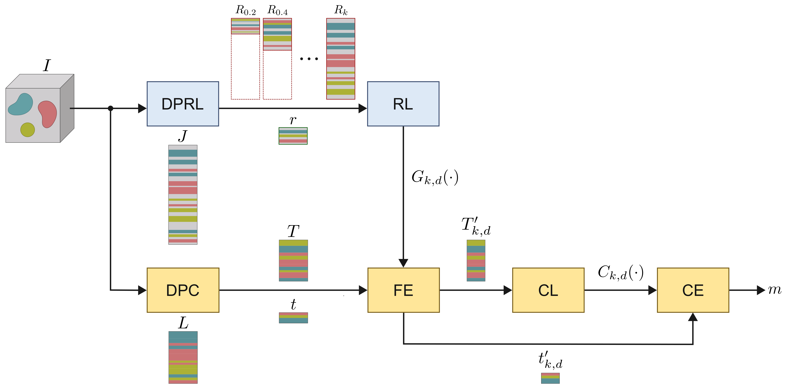

# Representation Learning for Hyperspectral Image Classification under Data Scarcity

[](URL_TO_YOUR_PAPER)
[](https://www.python.org/downloads/)
[](https://opensource.org/licenses/MIT)

Official PyTorch implementation of the methodology proposed in
**"Assessing the influence of using a reduced number of samples for creating different representation models for hyperspectral image classification"**

---

## 📌 Overview

This repository provides the complete experimental pipeline to evaluate the impact of training sample size ($k$) on various Representation Learning (RL) models for Hyperspectral Image (HSI) classification. The study rigorously compares **pixel-wise baselines** against advanced **spatial-spectral models** (including Vision Transformers) under extreme data scarcity constraints.

### Evaluated Architectures:
* **Pixel-wise Baselines:** Principal Component Analysis (PCA), Autoencoder (AE).
* **Spatial-spectral Baselines:** Joint Spatial Autoencoder (AE-Patch).
* **Transformer-based Models:** Vision Transformer (VIT), Masked Autoencoder VIT (MAE-VIT), Self-Distillation VIT (DINO-VIT).

---

## 📁 Repository Structure

**Proposed Methodology:**

<p align="center">
  
</p>
<br>

* `01_hsi_representation_learning.ipynb`: The core experimental notebook. Its internal structure is highly modular:
  * **Libraries & Functions:** Definition of RL architectures (PCA, AE, VIT, MAE-VIT, DINO-VIT) and downstream classifiers.
  * **Experimental Configurations ⭐:** The control center of the pipeline. Here, users can adjust the `DATASET_ID`, training data proportions ($k$), latent dimensions ($d$), and the specific sets of representation models and classifiers to evaluate.
  * **Stage I (DPRL):** Data preparation ensuring strict spatial-spectral partitions to prevent data leakage.
  * **Stage II (RL):** Automated execution of the Representation Learning training loops across the combinatorial grid.
  * **Classification:** Extraction of the latent space ($Z$) and downstream evaluation, exporting the final `.csv` performance metrics.
* `Results/Fig_Metodologia.pdf`: The official visual flowchart of the proposed methodology.
* `02_generate_visualizations.py`: An automated, publication-ready visualization script. It parses the raw output CSVs to generate:
  * Metric Divergence Tables (OA vs F1-Macro).
  * Classifier Stability Boxplots.
  * Latent Convergence Analysis Grids.
  * Class-wise Delta ($\Delta$) Heatmaps.
* `environment.yml`: The Conda configuration file containing the exact versions of the libraries used, guaranteeing full reproducibility.
* `Raw_Reports/`: Contains the raw CSV output (`*_Combined_Performance.csv`) from the trained models.
* `Results/` & `Results_Delta/`: Directories generated automatically by the plotting script containing the essential high-resolution vector figures (`.pdf`) used in the paper.

---

## 🚀 Quick Start

### 1. Environment & Requirements
We provide an `environment.yml` file to easily recreate the exact conda environment used for these experiments. The core dependencies include:
* **Python 3.11**
* **TensorFlow 2.21 & Keras 3.14** (Used for AE, VIT, MAE-VIT, DINO-VIT)
* **Scikit-Learn 1.8** (Used for PCA, SVM, RF, DT, NB)
* **XGBoost 3.2**
* **Pandas 3.0, Numpy 1.26, Matplotlib 3.10**

To create and activate the environment:
```bash
conda env create -f environment.yml
conda activate hsi_deep
```

### 2. Running the Experiments
To replicate the core experiments and generate the raw performance metrics (`*_Combined_Performance.csv`):
1. Open and execute `01_hsi_representation_learning.ipynb`.
2. The notebook will automatically partition the datasets, train the RL models across different latent dimensions ($d$) and data proportions ($k$), and evaluate the downstream classifiers.

### 3. Generating Publication Figures
To recreate the exact figures and tables featured in the paper from the raw results, run:
```bash
python 02_generate_visualizations.py Raw_Reports Results
```
*Note: The script automatically handles imbalance-aware evaluation, prioritizing F1-Macro over Overall Accuracy (OA) to mitigate majority-class bias.*

---

## 📊 Evaluation & Metric Divergence

This framework incorporates a strict **Metric Divergence Check**. As demonstrated in our experiments, optimizing exclusively for Overall Accuracy (OA) often leads to catastrophic failure in minority classes. This repository automatically generates divergence tables that empirically justify the selection of F1-Macro as the primary optimization target for imbalanced HSI datasets.

---

## 📝 Citation
If you find this code or our methodology useful in your research, please consider citing:

```bibtex
@article{YourName2026,
  title={Assessing the influence of using a reduced number of samples for creating different representation models for hyperspectral image classification},
  author={Your Name and Co-Authors},
  journal={IEEE Journal of Selected Topics in Applied Earth Observations and Remote Sensing (JSTARS)},
  year={2026},
  volume={X},
  pages={XX-XX}
}
```

## 📄 License
This project is licensed under the MIT License - see the LICENSE file for details.
